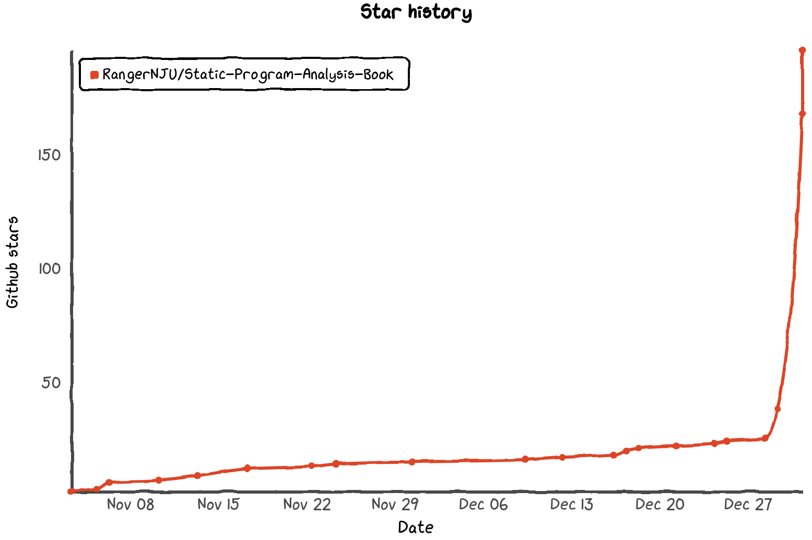

# Static Program Analysis Book

Getting started with static program analysis. Read this book and start writing your first static program analyzer! We focus on the problem:

> ❓ How to automatically and efficiently guaranrtee software quality

## 🚀 Release Notes and Milestones

1. **Oct. 2020**:
   1. Repository created;
   2. First star, fork and PR gained within a month.
2. **Nov. 2020**:
   1. Remove `IR` and `Data Flow Analysis` out of repository temporarily;
   2. Post lecture 7 to lecture 10.
3. **Dec. 2020**:
   1. Post lecture 11 and lecture 12.

All lectures and most materials have been posted! 🎉

We are considering recording some introductory videos as compelementary materials.

## 📕 How to Read This Book

* [Read This Book Online](https://ranger-nju.gitbook.io/static-program-analysis-book/)
  * Notes: if you are from Chinese mainland, the link above may be banned by GFW. You can instead try [here](https://spa-book.pblo.gq/).
* [Read This Book In Github Repository](https://github.com/RangerNJU/Static-Program-Analysis-Book)
* Read This Book Offline
  * Clone this repository to local: `git clone https://github.com/RangerNJU/Static-Program-Analysis-Book.git`;
  * Periodically pull the repository to make sure all contents are up-to-date: `git pull`;
  * Use your favored markdown readers ([Typora](https://typora.io/) recommended) to read this book.

## 👂 Express Yourself

* **Criticism values**. This is my first attempt to write a tutorial, it's not surprising this book is not perfect. If you feel you can improve this book or you find something worth discussion (including writing styles, content accuracy, readability, figure clarity, etc.), you can:

* Join our QQ group (group ID: 951182704) to discuss;
* Create a new issue;
* Contact me via email link: [ranger.nju\#gmail.com](mailto:ranger.nju@gmail.com)

If you find this book helpful, you can star this project and tell your friends about this book to support us. Thanks!

## ❤️ How to Contribute

If you want to improve this project, feel free to fork, modify and PR!

**Notes: please use relative path when referring to figures.**

## 🌍 Localization

We'd love help translating this book! Open a new issue to start working on a new language. Feel free to start :\)

## Other Related Projects

### Software QA Related

* 🇨🇳 [Gitbook: Introduction to Software Testing](https://ranger-nju.gitbook.io/software-testing-intro)
* [Github: Introduction to Software Testing](https://github.com/RangerNJU/Software-Testing-Intro)

### Brilliant Notes by Pioneers

* 🇨🇳 [Notes 1](https://blog.csdn.net/panhewu9919/article/details/106007155)
* 🇨🇳 [Notes 2](https://fancypei.github.io/SA/)

## Materials for Further Reading

### Course Videos & Reading Materials

- 🇨🇳 [Software Analyze Techniques](https://liveclass.org.cn/cloudCourse/#/courseDetail/8mI06L2eRqk8GcsW) by Yingfei Xiong, PKU;
- 🇺🇸 [17-355/17-665/17-819 Program Analysis (Spring 2019)](https://www.cs.cmu.edu/~aldrich/courses/17-355-19sp/) by Jonathan Aldrich, CMU;
- 🇺🇸 [Lecture notes on Static Program Analysis](https://cs.au.dk/~amoeller/spa/) by Anders Møller and Michael I. Schwartzbach

### Open-Source Softwares

* [pysonar2](https://github.com/yinwang0/pysonar2)
