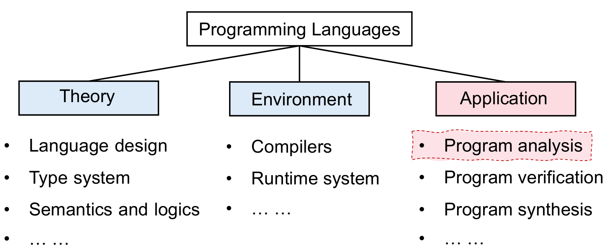
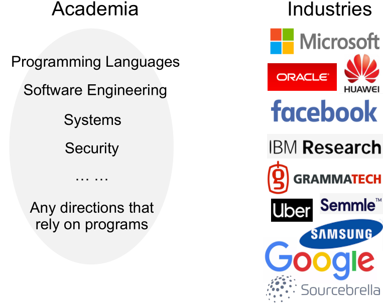
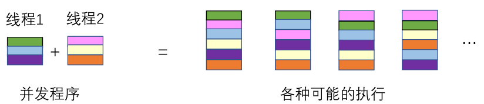
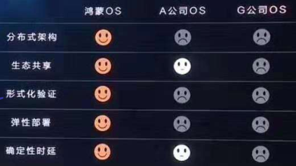

# What is Static Program Analysis?

## Its Role in Computer Science

**Static Program Analysis** is a detailed topic under the **application** of **programming languages**. It's the fundamental part of programming language related theories.

In programming language **theory**, we consider the design of a programming language, including the syntax, semantics, type system, etc.. To actually run programs written in the new language, we need to consider the runtime **environment**. The runtime environment includes compiler design and runtime support (e.g. memory allocation). In the **application** part, we focus on how to guarantee efficiency, security and reliability of the program. We will consider how to analyze, verify and synthesis programs.

### Types of Programming Languages

We face the following problem in the field of computer science: 👇🏼

> The core concepts of programming languages are not changing for decades. However, the size and complexity of software are growing fast. How can we guarantee software quality?

Although we have seen new programming languages and new language features these years, all programming languages can be classified into 3 categories:

* **Imperitive programming languages**: C, C++, Java, etc.;
* **Functional programming languages**: [Scala](https://www.scala-lang.org), [Haskell](https://www.haskell.org), etc.;
* **Logical programming languages**: [Prolog](https://en.wikipedia.org/wiki/Prolog), etc..

## Applications of Static Program Analysis

Static program analysis is one of the many techniques for solving the problem mentioned in the previous section. Static program analysis can be used to:

1. Improve software reliability.
   1. Null pointer dereference, memory leak, etc..
   2. Almost every developer have struggled with null pointer dereference and memory leak problems.
2. Improve software security.
   1. Private information leak, injection attack, etc..
   2. Private information leak is common in mobile applications. If you are interested in this problem, you can refer to [this paper](https://www.ieee-security.org/TC/SP2012/posters/ScanDal.pdf).
   3. Injection attack is a very common topic in the field of cybersecurity. If you are not familiar with it, you can find examples of the well-known SQL injection attack from [W3School](https://www.w3schools.com/sql/sql_injection.asp) or [Wikipedia](https://en.wikipedia.org/wiki/SQL_injection).
3. Provide fundamental techniques for compile-time optimizations.
   1. Dead code elimination, code motion, etc..
   2. [Dead code elimination](https://en.wikipedia.org/wiki/Dead_code_elimination) are applied during machine-independent optimizations. It removes those code that can never be reached (dead code) from the program.
   3. [Loop-invariant code motion](https://en.wikipedia.org/wiki/Loop-invariant_code_motion) are applied during machine-independent optimizations. It moves certain code out of its containing loop without modifying the semantics of the program. This can effectively reduce the number of instructions executed during runtime. For more detailed explanations, you can refer to [answers on StackOverflow](https://stackoverflow.com/questions/5607762/what-does-code-motion-mean-for-loop-invariant-code-motion).
4. Help understanding programs.
   1. IDE call hierarchy, type deduction, etc..
   2. Integrates with Integrated Development Environments (IDE): When you are in Visual Studio / IntelliJ IDEA / CLion / Eclipse / Android Studio or other IDEs, the IDE can display information about the symbol under your cursor. To implement this feature, you need static program analysis.

Besides, static program analysis can be used for analysing multi-threaded programs, which is a research field under active study. The primary difficulty in analysing multi-threaded programs is dealing with interleavings between different threads. In this book, we won't cover related topics since we are facing program analysis beginners.

## Markets of Static Program Analysis

* In academia, static program analysis techniques can be seen in almost all research topics related about programs;
* In industry, Google and IBM have established their own static program analysis teams. In mainland China, companies like Huawei and Alibaba are seeking for static program analysis professionals.
* Studying static program analysis techniques can bring you unique advances no matter whether you are looking for development in the academy or industry.

## Comparison between Static Program Analysis and Similar Techniques

> Testing shows the presence, not the absence of bugs. --Edsger W. Dijkstra

Dynamic software testing and formal semantic verification are two techniques that are similar with static program analysis. In this section, we will compare those three techniques.

### Static Program Analysis

* Pros:
  * Under a specified analysis precision, **you can prove that the program under test does not have any bugs.** We will talk about this later in this book.
* Cons:
  * Steep learning curve. In mainland China, only PKU and NJU have related courses, but without textbooks. As a senior elective course, it's difficult for students to begin and advance.
  * You tell me.

### Dynamic Software Testing

* Pros:
  * Widely applied in software engineering. It's effective, simple and easy to be automated.
* Cons:
  * **You cannot prove that the program under test does not have any bugs.** Because you cannot go through all possible program inputs during testing.
  * Under concurrent scenarios, the outcome of dynamic software testing is limited. Some bug may only be triggered under a very specific circumstance and thus hard to reproduce. If you are interested in testing concurrent programs, you can refer to [拧龙头法测试并发程序](https://zhuanlan.zhihu.com/p/51341151)(Chinese). The following figure is captured from the course _Formal Semantics_ in NJU.

### Formal Semantic Verification

* Pros:
  * **You can prove that the program under test does not have any bugs** since formal semantic verification requires mathematically abstracting the behavior of the program.
* Cons:
  * Learning curve is extremely steep. You need to be really good at math to be able to understand formal semantic verification.
  * The cost of verification is extremely high. Due to the extreme cost, few projects except those very important are using formal semantic verification to guarantee software quality. Even for important software such as operating system kernels, most projects don't use formal semantic verification to verify their correctness. The following screenshot are taken from the product launch of Harmany OS.

