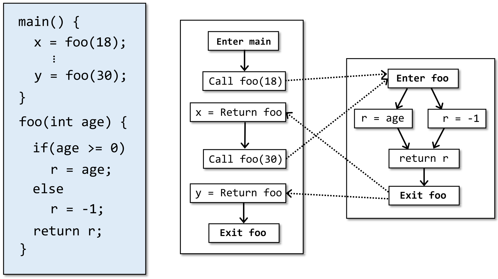
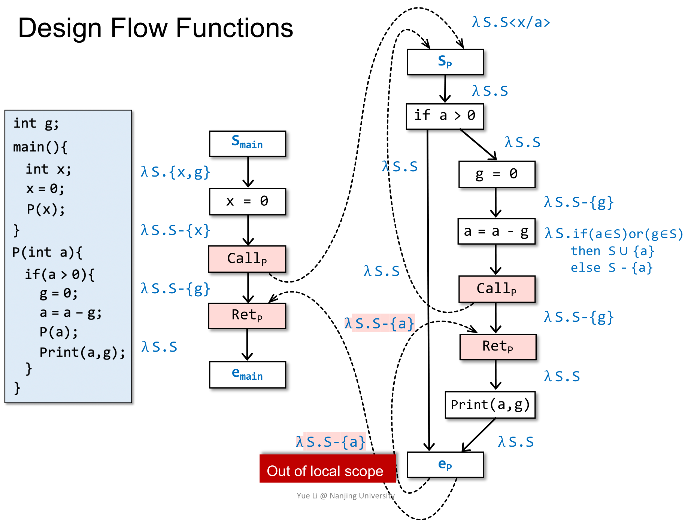

# CFL-Reachability and IFDS

<u>前排提醒：如果你已经忘记了**数据流分析理论基础**部分的内容，请务必去复习一下再读本文。</u>具体来说，你应该能够回忆起:

-   Meet/Join
-   Transfer function
-   Bottom/Top

---

标题看起来有点吓人，不过我们可以简单地描述一下即将要讲述的内容：

>   IFDS是一种分析框架，在这种框架下，分析的数据流是满足CFL-Reachability这一性质的。

本课主要内容如下：

1.  Feasible and Realizable Paths
2.  CFL-Reachability
3.  Overview of IFDS
4.  Supergraph and Flow Functions
5.  Exploded Supergraph and Tabulation Algorithm
6. Understanding the Distributivity of IFDS

# Feasible and Realizable Paths

实际分析时，JDK中一个方法能产生的CFG是非常复杂的。不过，并非所有的路径都会被执行到，一个很自然的想法是，只分析可能被执行的路径。

虽然并非所有的路径都会被执行到。**可是`判断一条路径是否feasible`本身是不可判定(undecidable)的。**

这并不代表我们束手无策了，我们来看一个例子：

动态执行时x和y都有确定的值，而上下文不敏感的分析中，x和y的取值都会是NAC，更具体的说，就是`{18,30,-1}`。

仔细地观察x的两个不精确的分析结果，可以发现-1这个结果在当前框架下是不可避免的：

而30这个不精确的结果则是可以避免的（比如使用我们之前介绍过的上下文敏感指针分析）：

定义一个新概念`Realizable Paths`：

>   The paths in which “returns” are matched with corresponding “calls”.

-   Realizable paths may not be executable, but unrealizable paths
    must not be executable.
    -   可以把executable/feasible path看作realizable path的真子集
-   Our goal is to **recognize realizable paths** so that we could avoid polluting analysis results along unrealizable paths.
    -   这个问题和括号匹配问题本质上是一样的。
    -   如果你是计算机系大一的学生，或许会想到用stack来做括号匹配问题。
    -   而如果你刚刚修过计算理论课程，你应该能够想起来使用上下文无关文法能够很好地识别一个匹配的括号串(Balanced-Parenthesis Problem)。

# CFL-Reachability

>   A path is considered to connect two nodes A and B, or **B is reachable from A**, only if **the concatenation of the labels on the edges of the path is a word in a specified context-free language.**

这里默认读者学习过上下文无关语言(context-free language)相关的知识（编译原理和计算理论几乎是每个学校计算机系的必修课）。具体来说，你应该知道：

-   终结符(nonterminal)
-   非终结符(terminal)
-   空串符号$$ \epsilon$$
-   （最左/最右）推导
-   正则文法/上下文无关文法和图灵机之间计算表达能力的差异

我们进一步定义一个语言`L(realizable)`，右侧黄色框中的4个字符串都是语言L的一部分。

还是太抽象了！我们拿两个例子来看看：

图中绿色标记的Call Edge和Return Edge分别是字符串中的$$ (_1$$和$$ )_1$$，而其他的边则是字符串中的e。

看完一个属于L的例子，再来一个不属于L的例子：

# Overview of IFDS

>   “Precise Interprocedural Dataflow Analysis via Graph Reachability”
>
>   --Thomas Reps, Susan Horwitz, and Mooly Sagiv, POPL’95

所谓IFDS，其实是四个单词(Interprocedural, Finite, Distributive, Subset)的缩写。如果一个问题满足这四个性质，则可以用相应的框架来解决问题。

复习两个旧概念，介绍一个新概念：

-   `Path Function`

    -   >   Path function for path p, denoted as $$ pf_p$$, is a composition of flow functions for all edges (sometimes nodes) on p

    -   可以理解按照顺序，先后应用一条path上edge/node的transfer function:

    -   

-   `Meet-Over-All-Paths(MOP)`

    -   >   For each node n, MOP n provides a “meet-over-all-paths” solution where Paths(start, n) denotes the set of paths in CFG from the start node to n.

    -   即对所有的开始点start，都以bottom作为path function的输入，并在终点n处对所有的结果做meet操作。

    -   

-   `Meet-Over-All-Realizable-Paths(MRP)`

    -   >   For each node n, MRP n provides a “meet-over-all-realizable-paths” solution where RPaths(start, n) denotes the set of realizable paths (the path’s word is in the language L(realizable)) from the start node to n.

    -   在前者概念的基础上限制Meet的对象为Realizable-Path

    -   

---

接下来要讲一些比较难懂的内容~~战术喝水~~。

# Supergraph and Flow Functions

## Supergraph

可以理解成IFDS分析体系下的ICFG(Interprocedural Control Flow Graph，即过程间控制流图)。这里只需要了解一下其中的三种edge（图中的G*即指supergraph）：

## Design Flow Functions

定义`Possibly-uninitialized variables`:

>   **For each node n** ∈ N*, determine **the set of variables that may be uninitialized** before execution reaches n.

我们接下来的例子求的就是这样的变量。

### lambda expression

为了后续叙述方便，这里简单地介绍一下lambda表达式。

以$$ \lambda$$标识一个lambda表达式，从开头到中间点间的符号代表**参数列表**，从中间点到最后的符号代表**函数体**。如下例子，就代表这样一个函数调用：

-   函数以x作为输入参数
-   函数返回值为x+1
-   调用函数时传入的参数为3

### Example of Flow Functions

在进入main后，全局变量g和局部变量x一定是没有初始化的。

随后x被初始化：

以x来初始化a，a是否被初始化与x一致。

这个函数比较奇妙，它表达的意思是：如果a和g都被初始化了，则a是被初始化的，否则认为a没有被初始化。

注意左侧以红色标记的函数，这样写能够使得在$$ Ret_p$$处g是否已经被赋值/初始化取决于是否在被调用函数中被赋值。

这里涉及一个特殊的情况，由于离开了函数，所以要去除函数内部变量a。

# Exploded Supergraph and Tabulation Algorithm

## Build Exploded Supergraph

Flow Function对应着二元关系。

直接从左到右解释例子：

1.  输出和输入完全一致
2.  无论输入为什么，输出都包含a
3.  输出一定不包含a，且一定包含b，其他变量（这里是c）则保持不变
4.  如果输入包含a，则输出一定包含b；否则一定不包含b

你是否也觉得上面例子中0->0这条边挺奇怪的？它的存在是被刻意设计的。因为IFDS主要依赖于可达性(reachability)做分析。如果没有这样的边，在IFDS中没有办法判断在n4这个点处，a是否满足某种性质。

而加上这条总是存在的Glue Edge之后，就可以满足IFDS分析的要求。

回到我们之前的例子，用新的二元关系的视角去**手动分析**，将会是这样（视频之后会做的会做的~~吧~~，咕！）：

标黄部分比较重要，它的意思是：如果a或g一开始没有被初始化，则a都没有被初始化。

最后构造出来的Exploded Supergraph是这样的：

怎样使用这样的分析结果呢？我们来考虑一个问题，全局变量g在程序片段运行结束时，是否可能没有被初始化？

结果是，g在这里可能没有被初始化。

而之前提到的realizable path在这里也能提供更高的精度。

## Tabulation Algorithm

刚才我们是手动分析的，而用Tabulation算法，可以在$$ O(ED^3)$$复杂度（E为Edge的数量，D为Data facts的数量，如在下面的例子中，D为3）下得到MRP的结果：

# Understanding the Distributivity of IFDS

这里的Distributivity是指Flow Function的性质，即满足：

$$ \forall(x,y). f(x\cdot y)=f(x)\cdot f(y)$$

-   这样的要求使得我们**无法用IFDS来做常量传播(constant propagation)和指针分析(pointer analysis)**
-   换句话说，在IFDS中，我们**可以表达逻辑或，但无法表达逻辑与**
-   更广泛地说，**如果我们需要考虑多个输入来决定输出**，那么由于Distributivity性质没有被满足，**无法用IFDS来解决**。

上图最后的问题答案是**可以使用IFDS，因为只需要考虑单一的输入即可决定输出**。

再来看看指针分析的例子：

注意图中的虚线部分，由于没有别名(alias)信息，这个边是无法被IFDS框架分析出来的。而IFDS是无法处理别名信息的，因为别名信息的另一种意义是“x和y**都**指向同一个对象”——这需要我们同时考虑x和y来决定他们是否指向同一个对象。

>   Note: If we want to obtain alias information in IFDS, say alias(x,y), to produce correct outputs, we need to consider multiple input data facts, x and y, which cannot be done in standard IFDS as **flow functions handle input facts independently (one fact per time). Thus pointer analysis is non-distributive.** 

## Key Points

-   Understand **CFL-Reachability**
-   Understand **the basic idea** of IFDS
    -   大概知道有几个阶段即可
-   Understand **what problems can be solved** by IFDS
